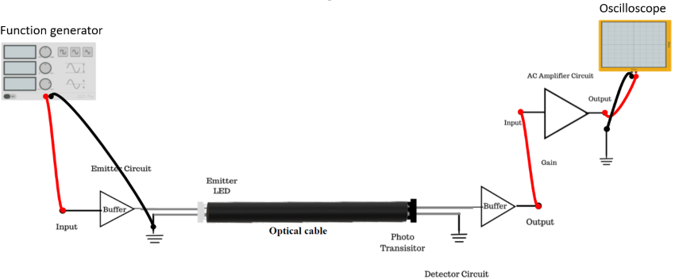

## Procedure 

1.  Make the connections as mentioned below.

    1.  Connect the Function Generator 1 KHz sine wave output to emitter input.
    2.  Connect 1 m optic fiber between emitter output and detector input.
    3.  Connect Detector output to amplifier input.

2.  Switch ‘On’ the Power Supply of TechBook and Oscilloscope.
3.  Set the Oscilloscope channel 1 to 0.5 V/ Div and adjust 4-6 div amplitude by using X 1 probe with the help of variable potentiometer in Function Generator block at input of emitter.
4.  Observe the output signal from detector on Oscilloscope.
5.  Adjust the amplitude of the received signal as that of transmitted one with the help of gain adjusts pot in AC amplifier block. Note this amplitude and name it V1 .
6.  Now replace the previous fiber optic cable with 5 m cable without disturbing any previous setting.
7.  Measure the amplitude at the receiver side again at output of amplifier. Note this value end name it V2 Calculate the propagation (attenuation) loss with the help of following formula.
α = - \[log (V1 / V2 )\] / (L1 + L2)  
Where,  
a = loss in nepers / meter  
1 nepers = 8.686 dB  
L1 = length of shorter cable (1 m)  
L2 = Length of longer cable (5 m)  

**Figure 1: Set up for Measurement of Losses in Plastic Fiber**

