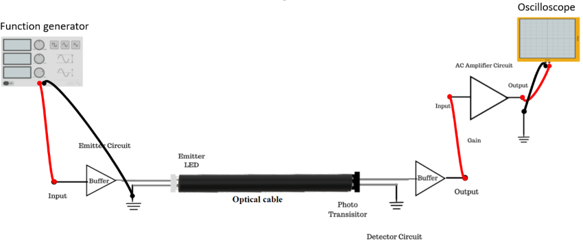

### Introduction

Attenuation is the loss of optical power as a result of absorption, scattering, bending, and other loss mechanisms as the light travels through the fiber. The total attenuation is a function of the wavelength λ of the light. The total attenuation A between two arbitrary points X and Y on the fiber is A(dB) = 10 log10 (Px/Py). Px is the power output at point X. Py is the power output at point Y. Point X is assumed to be closer to the optical source than point Y. The attenuation coefficient or attenuation rate α is given by α(dB/km) = A/L. Here L is the distance between points X and Y.

**Figure 1: Set up for Measurement of Losses in Plastic Fiber**

